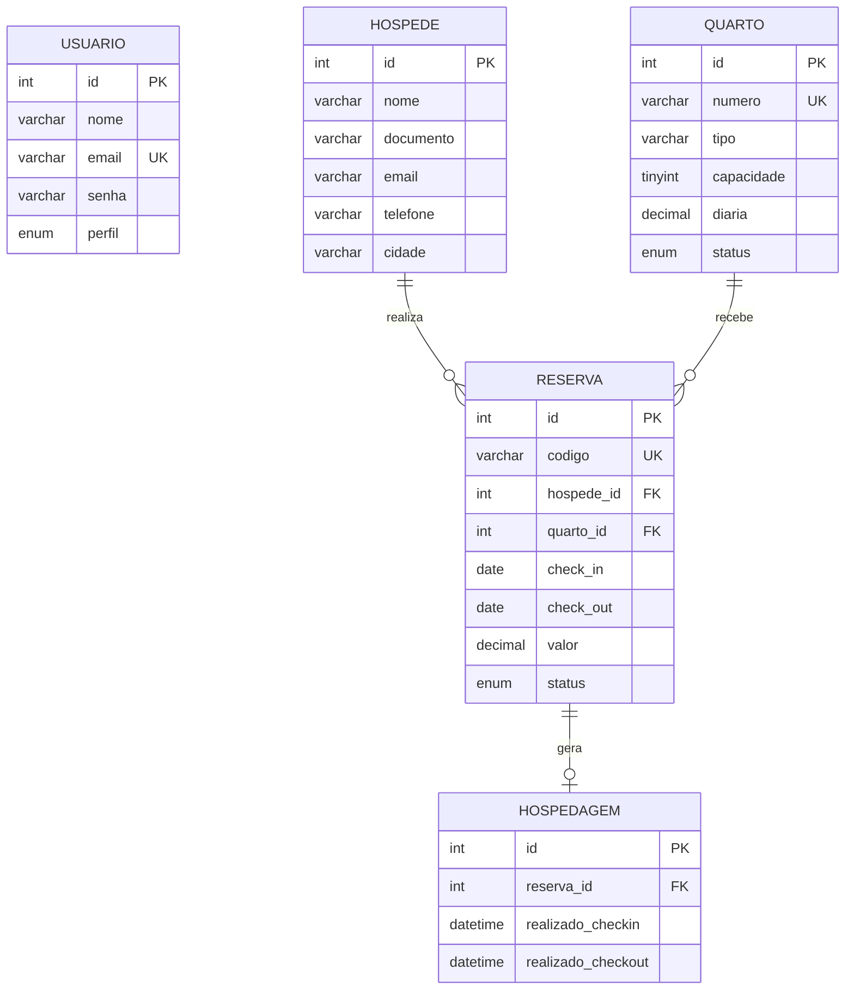

# HotelSys — Documentação do Software

## 1. Visão geral

O **HotelSys — Sistema de Gestão Hoteleira** informatiza o processo de hospedagem do Hotel SENAI Palace. O fluxo principal é **Hóspede → Reserva → Quarto → Check-in → Hospedagem → Check-out**. O sistema reduz o controle manual, centraliza informações operacionais e oferece uma consulta rápida de disponibilidade.

## 2. Levantamento de requisitos funcionais

| Código | Requisito |
|---|---|
| RF01 | O sistema deverá permitir o acesso de funcionários por e-mail e senha. |
| RF02 | O sistema deverá permitir cadastrar, consultar e editar hóspedes. |
| RF03 | O sistema deverá permitir cadastrar quartos, tipos, capacidade, diária e status. |
| RF04 | O sistema deverá permitir criar reservas vinculando hóspede, quarto, data de entrada e data de saída. |
| RF05 | O sistema deverá permitir localizar reservas por hóspede, código, quarto e status. |
| RF06 | O sistema deverá permitir consultar quartos disponíveis em determinado período. |
| RF07 | O sistema deverá permitir realizar check-in de uma reserva confirmada. |
| RF08 | O sistema deverá permitir registrar a hospedagem e acompanhar o quarto ocupado. |
| RF09 | O sistema deverá permitir realizar check-out, encerrando a hospedagem e liberando o quarto. |
| RF10 | O sistema deverá apresentar um dashboard com reservas ativas, hóspedes, quartos e taxa de ocupação. |
| RF11 | O sistema deverá permitir consultar o histórico de reservas e hospedagens. |
| RF12 | O sistema deverá permitir emitir ou visualizar relatório do movimento diário. |

## 3. Requisitos não funcionais

| Código | Categoria | Requisito |
|---|---|---|
| RNF01 | Segurança | As senhas deverão ser armazenadas usando hash seguro. O acesso às áreas internas deverá exigir sessão autenticada. |
| RNF02 | Segurança | As consultas ao MySQL deverão utilizar comandos preparados para reduzir o risco de injeção de SQL. |
| RNF03 | Desempenho | As consultas principais deverão retornar em até 2 segundos em uma instalação local com até 10.000 reservas. |
| RNF04 | Usabilidade | A interface deverá ser responsiva, apresentar mensagens claras e permitir navegação por teclado. |
| RNF05 | Compatibilidade | A aplicação deverá funcionar no XAMPP com Apache, PHP 8.1 ou superior, MySQL/MariaDB e navegadores modernos. |
| RNF06 | Manutenibilidade | A aplicação deverá separar configuração do banco, estilos, scripts e regras de apresentação. |

## 4. Infraestrutura necessária

| Componente | Especificação mínima | Função |
|---|---|---|
| Servidor local | XAMPP 8.1+ | Fornecer Apache, PHP e MySQL/MariaDB. |
| Sistema operacional | Windows, Linux ou macOS | Executar o ambiente XAMPP. |
| Banco de dados | MySQL 8 ou MariaDB 10.4+ | Persistir usuários, hóspedes, quartos, reservas e hospedagens. |
| Cliente | Chrome, Edge, Firefox ou Safari atualizado | Acessar a aplicação pelo navegador. |
| Hardware | 4 GB RAM e 2 GB livres em disco | Executar o ambiente local de desenvolvimento. |

## 5. Modelo entidade-relacionamento



A entidade **Hóspede** pode realizar várias reservas. Cada **Reserva** referencia um hóspede e um quarto. Uma reserva pode gerar no máximo uma **Hospedagem**, que registra os horários efetivos de check-in e check-out. O status do **Quarto** representa a disponibilidade operacional atual.

## 6. Instalação no XAMPP

1. Copie a pasta `MaqPlace` para `C:\xampp\htdocs\hotelsys`.
2. Abra o XAMPP Control Panel e inicie **Apache** e **MySQL**.
3. Acesse `http://localhost/phpmyadmin`.
4. Importe o arquivo `database/hotelsys.sql`.
5. Se necessário, ajuste `config/database.php` para o usuário, senha ou porta do MySQL local.
6. Acesse `http://localhost/hotelsys/`.
7. Utilize `admin@senai.br` com a senha `123456` para a demonstração. Altere essa senha antes de colocar o sistema em produção.

## 7. Estrutura do projeto

```text
hotelsys/
├── assets/css/style.css
├── assets/js/app.js
├── config/database.php
├── database/hotelsys.sql
├── docs/requisitos.md
└── index.php
```

## 8. Escopo da entrega

Esta primeira versão entrega autenticação, dashboard operacional, listagem de reservas, quartos e hóspedes, busca instantânea, formulário de nova reserva demonstrativo e script de banco de dados. Os módulos de check-in e check-out estão representados na navegação e podem ser conectados às tabelas `hospedagens` na próxima iteração.

## Referências

[1]: https://www.php.net/manual/pt_BR/book.pdo.php "PHP Data Objects — Manual do PHP"

[2]: https://dev.mysql.com/doc/ "MySQL Documentation"

[3]: https://www.apachefriends.org/pt_br/index.html "XAMPP — Apache Friends"
